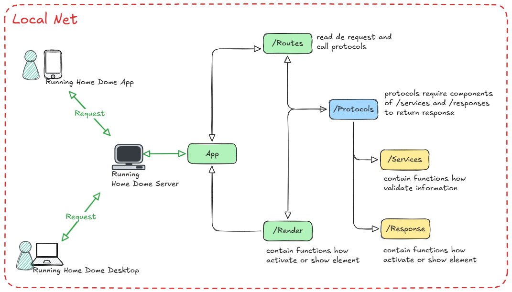

# home-dome-server

## Description
Home Dome is designed as a home control ecosystem divided into three components: Home Dome Server, which serves as the core of the service and is essential for the other components to function; Home Dome Desktop, a desktop application for remote control and access to Home Dome Server services from Linux, macOS, and Windows devices; and Home Dome Mobile, a smartphone app for controlling and accessing Home Dome Server services from smartphones.

